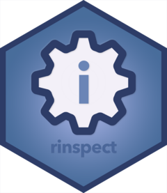
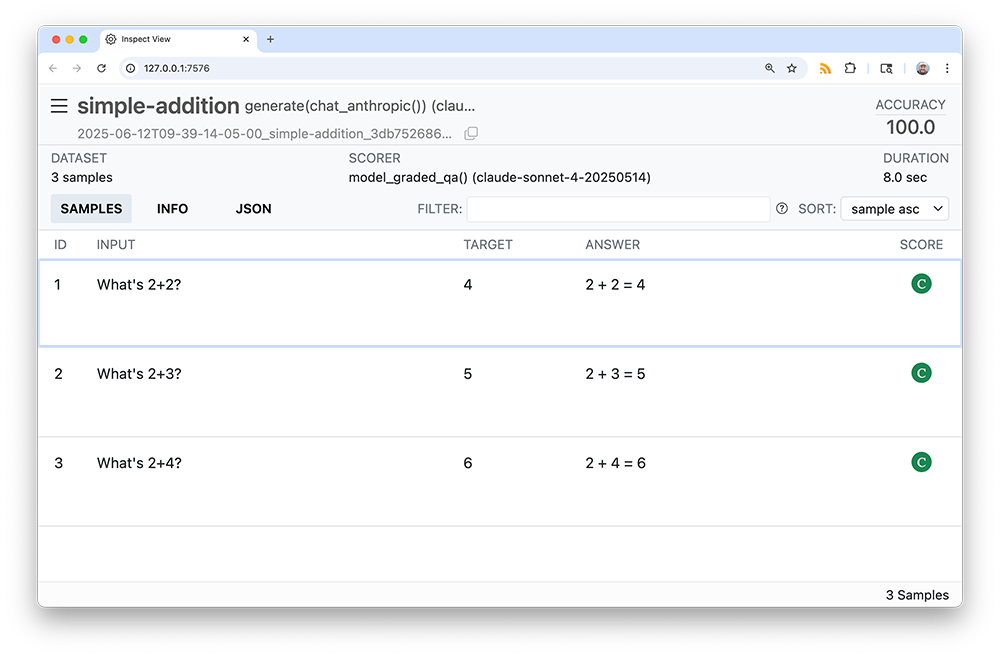

<!-- README.md is generated from README.Rmd. Please edit that file -->

# rinspect <a href="https://simonpcouch.github.io/rinspect/"></a>

<!-- badges: start -->

[](https://lifecycle.r-lib.org/articles/stages.html#experimental)
[](https://CRAN.R-project.org/package=rinspect)
[](https://github.com/simonpcouch/rinspect/actions/workflows/R-CMD-check.yaml)
<!-- badges: end -->

rinspect is a framework for large language model evaluation in R. It’s
specifically aimed at [ellmer](https://ellmer.tidyverse.org/) users who
want to measure the effectiveness of their LLM-based apps.

The package is an R port of the widely adopted Python framework
[Inspect](https://inspect.ai-safety-institute.org.uk/). While the
package doesn’t integrate with Inspect directly, it allows users to
interface with the [Inspect log
viewer](https://inspect.ai-safety-institute.org.uk/log-viewer.html) and
provides an on-ramp to transition to Inspect if need be by writing
evaluation logs to the same file format.

> **Important**
>
> 🚧 Under construction! 🚧
>
> rinspect is highly experimental and much of its documentation is
> aspirational.

## Installation

You can install the developmental version of rinspect using:

``` r
pak::pak("simonpcouch/rinspect")
```

## Example

LLM evaluation with rinspect is composed of two main steps.

``` r
library(rinspect)
library(ellmer)
library(tibble)
```

1)  First, create an evaluation **task** with the `Task$new()` method.

``` r
simple_addition <- tibble(
  input = c("What's 2+2?", "What's 2+3?", "What's 2+4?"),
  target = c("4", "5", "6")
)

tsk <- Task$new(
  dataset = simple_addition, 
  solver = generate(chat_anthropic()), 
  scorer = model_graded_qa()
)
#> Using model = "claude-3-7-sonnet-latest".
```

Tasks are composed of three main components:

- **Datasets** are a data frame with, minimally, columns `input` and
  `target`. `input` represents some question or problem, and `target`
  gives the target response.
- **Solvers** are functions that take `input` and return some value
  approximating `target`, likely wrapping ellmer chats. `generate()` is
  the simplest scorer in rinspect, and just passes the `input` to the
  chat’s `$chat()` method, returning its result as-is.
- **Scorers** juxtapose the solvers’ output with `target`, evaluating
  how well the solver solved the `input`.

2)  Evaluate the task.

``` r
tsk$eval()
```

`$eval()` will run the solver, run the scorer, and then situate the
results in a persistent log file that can be explored interactively with
the Inspect log viewer.



Any arguments to the solver or scorer can be passed to `$eval()`,
allowing for straightforward parameterization of tasks. For example, if
I wanted to evaluate `chat_openai()` on this task rather than
`chat_anthropic()`, I could write:

``` r
tsk_openai <- tsk$clone()
tsk_openai$eval(solver_chat = chat_openai())
```

For an applied example, see the “Getting started with rinspect” vignette
at `vignette("rinspect", package = "rinspect")`.
