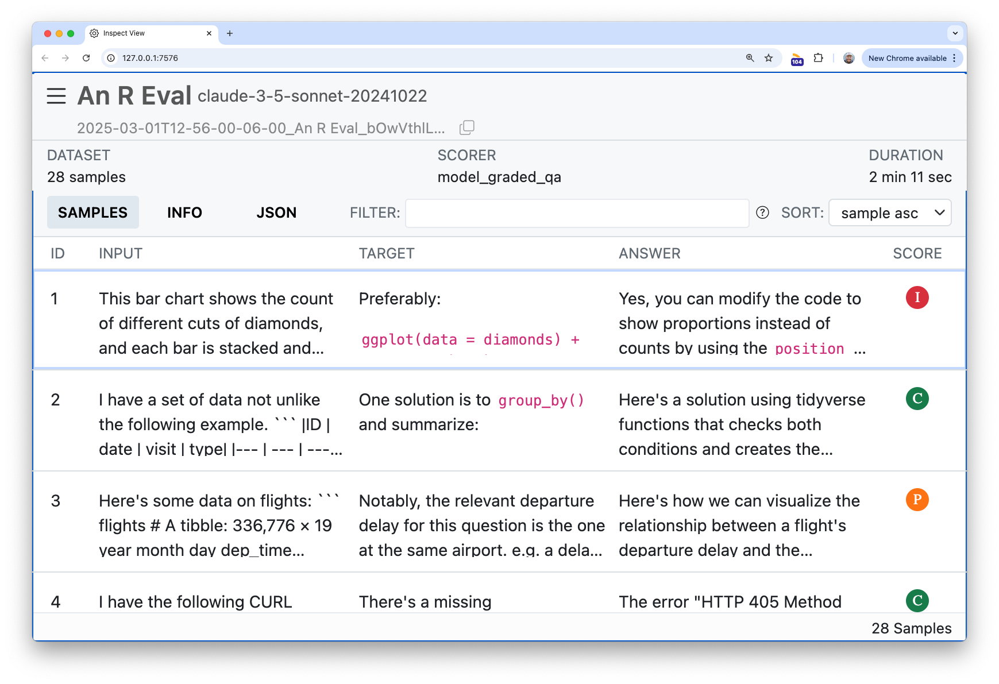

```{r, include = FALSE}
knitr::opts_chunk$set(
  collapse = TRUE,
  comment = "#>",
  eval = rlang::is_installed("ggplot2")
)

cat <- function(x, width = 0.9 * getOption("width")) {
  lines <- unlist(strsplit(x, "\n"))
  wrapped <- unlist(lapply(lines, strwrap, width = width))
  base::cat(wrapped, sep = "\n")
}

withr::local_envvar(list(VITALS_LOG_DIR = "vignettes/data/logs/"))

# don't set this as the default `eval`, but use it as a
# flag for the computationally intensive steps
should_eval <- identical(Sys.getenv("VITALS_SHOULD_EVAL"), "true")

if (!should_eval) {
  load(here::here("vignettes/data/are_task.rda"))
  load(here::here("vignettes/data/are_task_openai.rda"))
}
```

At their core, LLM evals are composed of three pieces:

1) **Datasets** contain a set of labelled samples. Datasets are just a tibble with columns `input` and `target`, where `input` is a prompt and `target` is either literal value(s) or grading guidance.
2) **Solvers** evaluate the `input` in the dataset and produce a final result (hopefully) approximating `target`. In vitals, the simplest solver is just an ellmer chat (e.g. `ellmer::chat_anthropic()`) wrapped in `generate()`, i.e. `generate(ellmer::chat_anthropic()`), which will call the Chat object's `$chat()` method and return whatever it returns.
3) **Scorers** evaluate the final output of solvers. They may use text
comparisons, model grading, or other custom schemes to determine how well the solver approximated the `target` based on the `input`. 

This vignette will explore these three components using `are`, an example dataset that ships with the package.

First, load the required packages:

```{r setup}
#| message: false
#| warning: false
#| eval: true
library(vitals)
library(ellmer)
library(dplyr)
library(ggplot2)
```

## An R eval dataset

From the `are` docs:

> An R Eval is a dataset of challenging R coding problems. Each `input` is a question about R code which could be solved on first-read only by human experts and, with a chance to read documentation and run some code, by  fluent data scientists. Solutions are in `target` and enable a fluent  data scientist to evaluate whether the solution deserves full, partial, or no credit.

```{r explore-dataset}
glimpse(are)
```

At a high level:

- `id`:  A unique identifier for the problem.
- `input`: The question to be answered.
- `target`: The solution, often with a description of notable features of a correct solution.
- `domain`, `task`, and `knowledge` are pieces of metadata describing the kind of R coding challenge.
- `source`: Where the problem came from, as a URL. Many of these coding problems are adapted "from the wild" and include the kinds of context usually available to those answering questions.

For the purposes of actually carrying out the initial evaluation, we're specifically interested in the `input` and `target` columns. Let's print out the first entry in full so you can get a taste of a typical problem in this dataset:

```{r input-1}
cat(are$input[1])
```

Here's the suggested solution:

```{r target-1}
cat(are$target[1])
```

## Creating and evaluating a task

LLM evaluation with vitals happens in two main steps:

1) Use `Task$new()` to situate a dataset, solver, and scorer in a `Task`.

```{r create-task, eval = should_eval}
are_task <- Task$new(
  dataset = are,
  solver = generate(chat_anthropic(model = "claude-3-7-sonnet-latest")),
  scorer = model_graded_qa(partial_credit = TRUE),
  name = "An R Eval"
)

are_task
```

2) Use `Task$eval()` to evaluate the solver, evaluate the scorer, and then explore a persistent log of the results in the interactive Inspect log viewer.

```{r solve-and-score, eval = should_eval}
are_task$eval()
```

```{r save-are-task-scored}
#| include: false
if (should_eval) {
  save(are_task, file = here::here("vignettes/data/are_task.rda"))
}
```

After evaluation, the task contains information from the solving and scoring steps. Here's what the model responded to that first question with:

```{r output-1}
cat(are_task$samples$result[1])
```

The task also contains score information from the scoring step. We've used `model_graded_qa()` as our scorer, which uses another model to evaluate the quality of our solver's solutions against the reference solutions in the `target` column. `model_graded_qa()` is a model-graded scorer provided by the package. This step compares Claude's solutions against the reference solutions in the `target` column, assigning a score to each solution using another model. That score is either `1` or `0`, though since we've set `partial_credit = TRUE`, the model can also choose to allot the response `.5`. vitals will use the same model that generated the final response as the model to score solutions.

Hold up, though—we're using an LLM to generate responses to questions, and then using the LLM to grade those responses?

```{r}
#| echo: false
#| fig-alt: "The meme of 3 spiderman pointing at each other."
knitr::include_graphics("https://cdn-useast1.kapwing.com/static/templates/3-spiderman-pointing-meme-template-full-ca8f27e0.webp")
```

This technique is called "model grading" or "LLM-as-a-judge." Done correctly, model grading is an effective and scalable solution to scoring. That said, it's not without its faults. Here's what the grading model thought of the response:

```{r}
cat(are_task$samples$scorer_chat[[1]]$last_turn()@text)
```

## Analyzing the results

Especially the first few times you run an eval, you'll want to inspect (ha!) its results closely. The vitals package ships with an app, the Inspect log viewer, that allows you to drill down into the solutions and grading decisions from each model for each sample. In the first couple runs, you'll likely find revisions you can make to your grading guidance in `target` that align model responses with your intent.

```{r}
#| label: tsk-view
#| echo: false
#| fig-alt: "The Inspect log viewer, an interactive app displaying information on the samples evaluated in this eval."
if (identical(Sys.getenv("IN_PKGDOWN"), "true")) {
  htmltools::tags$iframe(
    src = "../example-logs/vitals/index.html",
    width = "100%", 
    height = "600px",
    style = "border-radius: 10px; box-shadow: 0 5px 10px rgba(0, 0, 0, 0.3);"
  ) 
} else {
  
}
```

<br>

Under the hood, when you call `task$eval()`, results are written to a `.json` file that the Inspect log viewer can read. The Task object automatically launches the viewer when you call `task$eval()` in an interactive session. You can also view results any time with `are_task$view()`. You can explore this eval above (on the package's pkgdown site).

For a cursory analysis, we can start off by visualizing correct vs. partially correct vs. incorrect answers:

```{r plot-1}
#| fig-alt: "A ggplot2 bar plot, showing Claude was correct most of the time."
are_task_data <- vitals_bind(are_task)

are_task_data

are_task_data %>%
  ggplot() +
  aes(x = score) +
  geom_bar()
```

Claude answered fully correctly in `r sum(are_task_data$score == "C")` out of `r nrow(are_task_data)` samples, and partially correctly `r sum(are_task_data$score == "P")` times.For me, this leads to all sorts of questions:

* Are there any models that are cheaper than Claude that would do just as well? Or even a local model?
* Are there other models available that would do better out of the box?
* Would Claude do better if I allow it to "reason" briefly before answering?
* Would Claude do better if I gave it tools that'd allow it to peruse documentation and/or run R code before answering? (See [`btw::btw_register_tools()`](https://posit-dev.github.io/btw/reference/btw_register_tools.html) if you're interested in this.)

These questions can be explored by evaluating Tasks against different solvers and scorers. For example, to compare Claude's performance with OpenAI's GPT-4o, we just need to clone the object and then run `$eval()` with a different solver `chat`:

```{r are-task-openai, eval = should_eval}
are_task_openai <- are_task$clone()
are_task_openai$eval(solver_chat = chat_openai(model = "gpt-4o"))
```

```{r save-are-task-openai}
#| include: false
if (should_eval) {
  save(are_task_openai, file = here::here("vignettes/data/are_task_openai.rda"))
}
```

Any arguments to solving or scoring functions can be passed directly to `$eval()`, allowing for quickly evaluating tasks across several parameterizations.

Using this data, we can quickly juxtapose those evaluation results:

```{r}
are_task_eval <-
  vitals_bind(are_task, are_task_openai) %>%
  mutate(
    task = if_else(task == "are_task", "Claude", "GPT-4o")
  ) %>%
  rename(model = task)

are_task_eval %>%
  mutate(
    score = factor(
      case_when(
        score == "I" ~ "Incorrect",
        score == "P" ~ "Partially correct",
        score == "C" ~ "Correct"
      ),
      levels = c("Incorrect", "Partially correct", "Correct"),
      ordered = TRUE
    )
  ) %>%
  ggplot(aes(y = model, fill = score)) +
  geom_bar() +
  scale_fill_brewer(breaks = rev, palette = "RdYlGn")
```

Is this difference in performance just a result of noise, though? We can supply the scores to an ordinal regression model to answer this question.

```{r}
library(ordinal)

are_mod <- clm(score ~ model, data = are_task_eval)

are_mod
```

```{r}
#| include: false
grade_descriptor <- if (are_mod[["coefficients"]][3] > 0) "higher" else "lower"
```

The coefficient for `model == "GPT-4o"` is `r round(are_mod[["coefficients"]][3], 3)`, indicating that GPT-4o tends to be associated with `r grade_descriptor` grades. If a 95% confidence interval for this coefficient contains zero, we can conclude that there is not sufficient evidence to reject the null hypothesis that the difference between GPT-4o and Claude's performance on this eval is zero at the 0.05 significance level.

```{r}
confint(are_mod)
```

:::callout-note
If we had evaluated this model across multiple epochs, the question ID could become a "nuisance parameter" in a mixed model, e.g. with the model structure `ordinal::clmm(score ~ model + (1|id), ...)`.
:::

This vignette demonstrated the simplest possible evaluation based on the `are` dataset. If you're interested in carrying out more advanced evals, check out the other vignettes in this package!

```{r, eval = should_eval}
#| include: false
# deploy the resulting logs inside of the page by bundling them into
# `pkgdown/assets/`
dest_dir <- here::here("pkgdown/assets/example-logs/vitals")
vitals_bundle(
  log_dir = here::here("vignettes/data/logs"), 
  output_dir = dest_dir, 
  overwrite = TRUE
)
```
